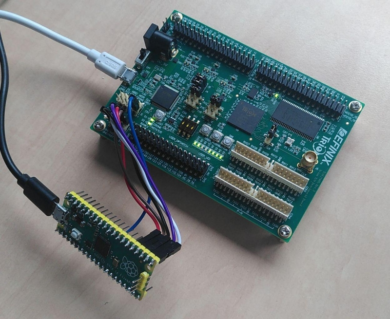
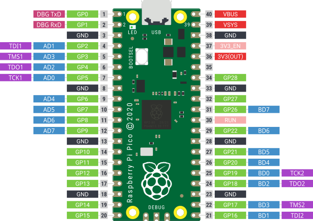

# Pico MPPSE

This is a FTDI MPSSE compatible JTAG implementation for the Raspberry
Pi Pico's RP2040 MCU. It allows to use the Raspberry Pi Pico as a
replacement for the FTDI MPSSE ftx232 device family and use the Pico
e.g. as a flash adapter for FPGA boards.

This image shows an Efinix Trion T20 BGS256 Development Kit being
programmed using a Raspberry Pi Pico and bypassing the on-board ft2232.



## Pin usage



## Current state

The device implements a very basic MPSSE sufficient to be used for two
JTAG ports as present on ftx232 like devices as well. It also
implements parts of the BITBANG mode and the GPIO handling to allow to
use ports BD[4-7] and AD[4-7] to generate control signals. The efinix
FPGAs e.g. use pin AD[4] to control the FPGAs CRESET signal.

It has successfully been used to detect various chips in a JTAG border
scan and to program the Efinix Trion T20 FPGA using
[openFPGAloader](https://github.com/trabucayre/openFPGALoader) as well
as the [Efinity Programmer](https://www.efinixinc.com/products-efinity.html).

## Installation

Build this using the [Pico-SDK](https://github.com/raspberrypi/pico-sdk) and
load it onto a Raspberry Pi Pico.

This uses UART0 on GPIO0+1 for debug output at 115200 bit/s.

## Usage

The device should show up via USB as an FT2232:

```
$ lsusb
...
Bus 001 Device 003: ID 0403:6010 Future Technology Devices International, Ltd FT2232C/D/H Dual UART/FIFO IC
...
```

The openFPGAloader should be able to open and use it:

```
$ openFPGAloader -b trion_t20_bga256_jtag --detect
empty
No cable or board specified: using direct ft2232 interface
Jtag frequency : requested 6.00MHz   -> real 6.00MHz  
index 0:
        idcode 0x210a79
        manufacturer efinix
        family Trion
        model  T8QFP144/T13/T20
        irlength 4
```

Attention: The support for the Trion T20 dev board has recently been
fixed in openFPGAloader and you might need to pull it freshly from
github to work. This is not related to the PICO MPSSE and applies to
using the dev kits on-board programmer as well.

## Related projects

  - [Pico-DirtyJtag](https://github.com/phdussud/pico-dirtyJtag)
  - [openFPGAloader](https://trabucayre.github.io/openFPGALoader/index.html)
